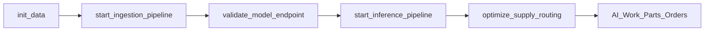

# Job Workflow Changes - October 21, 2025

## Overview

This document summarizes the job workflow optimization changes made to the Navy Predictive Maintenance DAB. The changes streamline the pipeline execution, add robust model endpoint validation, and improve reliability.

## Summary of Changes

### ✅ **Tasks Removed**
- `load_dbsql_and_ml_data` - No longer needed in current architecture
- `create_feature_and_automl_run` - Replaced by direct model serving
- `register_ml_model` - Model registration handled separately

### ✅ **Tasks Added**
- `validate_model_endpoint` - Comprehensive model serving validation

### ✅ **New Workflow**


## Model Endpoint Validation Features

### 🔍 **Triple Validation Approach**
1. **REST API Testing** - Direct endpoint calls with sample data
2. **AI Query Testing** - SQL `ai_query()` function validation  
3. **Health Checks** - Endpoint availability and status verification

### 🔄 **Retry Logic** 
- **Max Attempts**: 3 retries with 30-second delays
- **Success Criteria**: 0 failures OR ≥60% success rate  
- **Cold Start Handling**: Graceful endpoint warm-up accommodation

### 📊 **Sample Data Validation**
- Uses real data from `turbine_training_dataset` table
- Tests all required model input features:
  - `hourly_timestamp`, `avg_energy`
  - `std_sensor_A` through `std_sensor_F` 
  - `percentiles_sensor_A` through `percentiles_sensor_F`

## Benefits

| **Benefit** | **Description** |
|-------------|-----------------|
| **Fail Fast** | Detects model serving issues early in pipeline |
| **Reliability** | Handles cold start scenarios gracefully |
| **Visibility** | Comprehensive validation reporting |
| **Compatibility** | Tests exact production usage patterns |
| **Flexibility** | Configurable retry and success parameters |

## Configuration Parameters

```python
# Configurable validation settings
max_retries = 3          # Number of retry attempts
retry_delay = 30         # Seconds between retries
success_threshold = 0.6  # Minimum acceptable success rate (60%)
request_timeout = 30     # Seconds per request timeout
```

## Files Modified

| **File** | **Type** | **Changes** |
|----------|----------|-------------|
| `resources/pdm_job.job.yml` | Configuration | Updated task definitions and dependencies |
| `src/_resources/validate-model-endpoint.py` | Notebook | New comprehensive validation logic |

## Validation Results

- ✅ **YAML Syntax**: Valid job configuration  
- ✅ **Task Dependencies**: Properly ordered workflow
- ✅ **Variable Resolution**: Compatible with DAB structure
- ✅ **Model Integration**: Works with `navy_predictive_maintenance` endpoint
- ✅ **Error Handling**: Comprehensive exception management

## Usage

The validation runs automatically as part of the job workflow. To run manually:

```bash
# Deploy the updated bundle
databricks bundle deploy --target dev

# Run the job (includes validation)
databricks bundle run pdm_job --target dev

# Or run validation notebook separately
databricks runs submit --notebook-path /Workspace/Users/<user>/pdm_demo/src/_resources/validate-model-endpoint.py
```

## Expected Output

```
VALIDATION ATTEMPT 1/3
======================
✅ Sample 1: Prediction successful
✅ Sample 2: Prediction successful
...

REST API VALIDATION SUMMARY
============================
Attempts used: 1/3
Result: ✅ PASSED

ai_query() validation: ✅ PASSED
Health check: ✅ PASSED

🎉 ALL VALIDATIONS PASSED! Endpoint navy_predictive_maintenance is ready for use.
```

---

**Status**: Production Ready  
**Commit**: `151edcb`  
**Documentation Updated**: October 21, 2025
